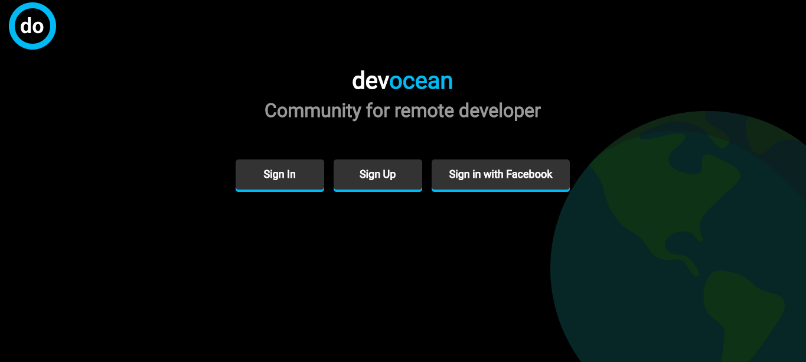
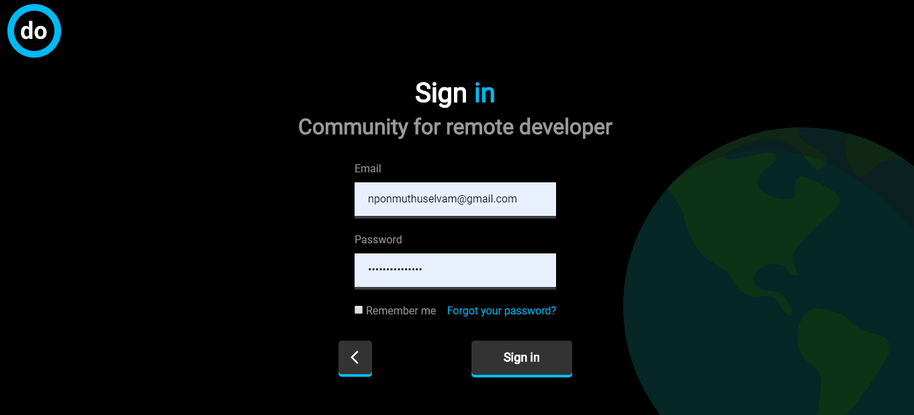
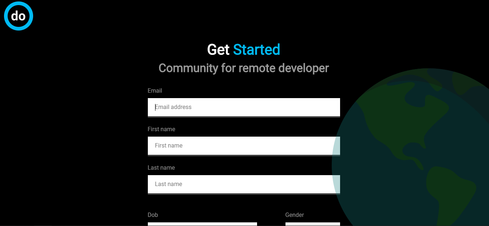
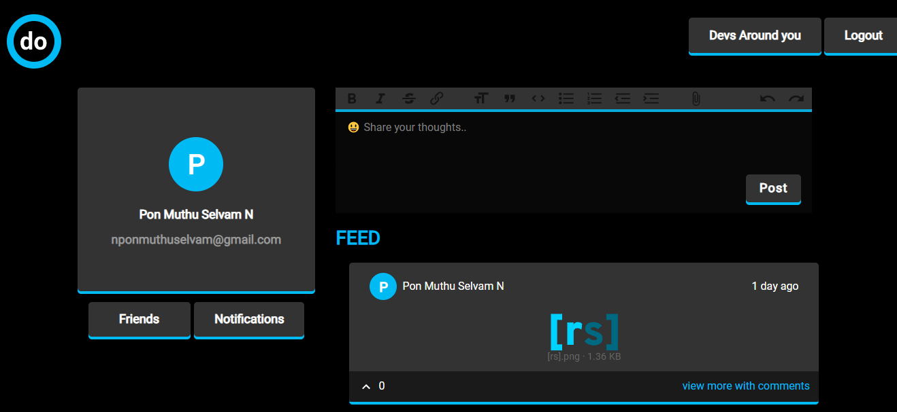
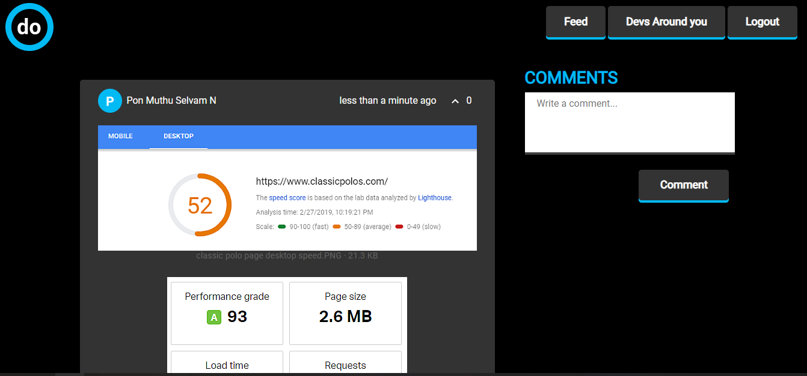

# devocean
social network for remote developers and learners
## Installation ⚙
### Requirements
- Ruby 2.6
- Rails 6
- Postgres
- Webpacker
- Foreman (To run procfile.dev)
- ActionText
- ImageMagick(For ImageProcessing gem)
#### Useful links
- [Install imagemagick on debian ubuntu](https://www.tecmint.com/install-imagemagick-on-debian-ubuntu/)
### Clone
```bash
git clone https://github.com/imhta/devocean.git
cd devocean
```
Setup and Start Rails server
```bash
bundle
rails db:migrate
rails server
```
##### For Webpack server
In a new Terminal 
```bash
foreman start -f Procfile.dev
```
#### Test
```bash
bundle exec rspec
```
## Features :star: 
- WYSIWYG editor for post
- PWA
## ERD


## Screenshots

#### Home page (before sign in)


#### Sign in page


#### Sign up page


#### feed page


#### showpost page



## Author
- [@imhta](https://github.com/imhta)
- [@Abdusaid](https://github.com/Abdusaid10)
